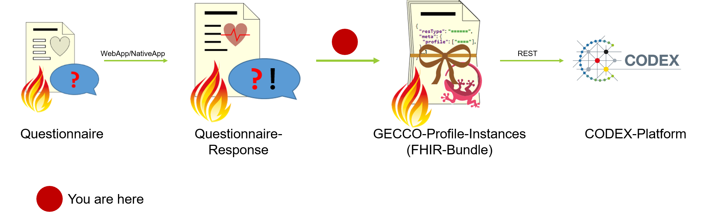
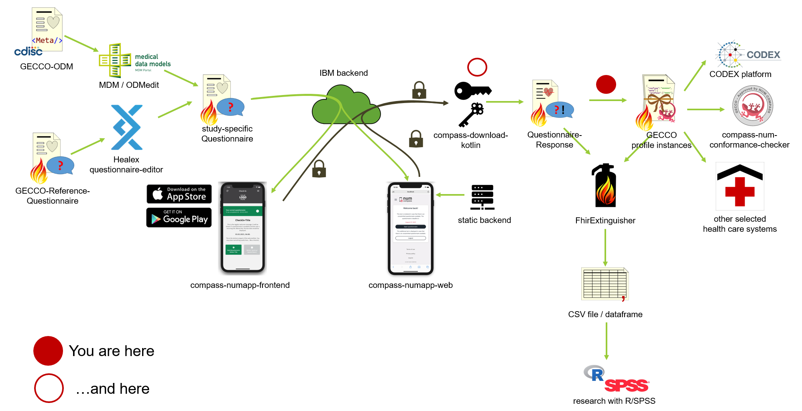
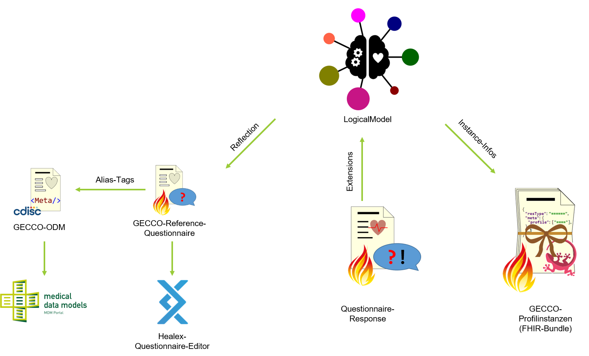

# compass-interface-codex
In short: This is the interface between NUM-Compass (which
uses [FHIR Questionnaires](http://hl7.org/fhir/questionnaire.html))
and [NUM-CODEX RDP](https://www.netzwerk-universitaetsmedizin.de/projekte/codex) platform (which uses
the [FHIR GECCO Profiles](https://simplifier.net/guide/germancoronaconsensusdataset-implementationguide/home)).



This project consists of three components, which can also be used on their own:

* [**compass-download-kotlin**](./compass-download-kotlin): A JVM implementation, that basically does the same as
  the [Python downloader](https://github.com/NUMde/compass-numapp-downloader). It downloads and decrypted the queue
  items from the backend.
* [**gecco-easy**](./gecco-easy): A set of template functions, that can be used to fill easier the GECCO profiles.
* [**gecco-questionnaire**](./gecco-questionnaire): Defines a logical model for gecco and creates the reference
  Questionnaire from that, also contains code to extract the GECCO Profiles from the logical model.


  
## How dows this work?


The LogicalModel (`gecco-questionnaire/src/main/kotlin/LogicalModel.kt`) is introspected via reflection to generate a reference Questionnaire,
from which the items can be edited or copied into another Questionnaire, preferably the 
[questionnare editor Healex developed for Compass](https://github.com/NUMde/compass-questionnaire-editor). The relation 
to the LogicalModel is preserved in the [`https://num-compass.science/fhir/StructureDefinition/CompassGeccoItem`](https://github.com/NUMde/compass-implementation-guide/blob/master/input/pagecontent/index.md) extension.

This is extension should be also available on the items on the resulting QuestionnaireResponse by the EDC app. At the moment, 
as a temporary solution, this component will copy the extensions from the Questionnaire in FHIR. 

The extension is used to fill the LogicalModel, the LogicalModel can be converted into a Bundle of FHIR resources conforming to the GECCO profiles.

## Usage
### IMPORTANT HINT
⚠You need to use **at least Java 8 Update 161, Java 9 or newer**, due to the fact that older versionen cannot use AES with more than
128 Bit due to legal reasons.

## Beginning 
Download .jar file from GitHub's releases page and execute: 
```
java -jar compass-interface-codex-1.0.1-all.jar 
   --serverUrl "http://127.0.0.1:8080/" 
   --apiId test 
   --apiKey gKdKLYG2g0-Y1EllI0-W 
   --privateKey private_key.pem 
   --publicKey public_key.pem 
   --certificate cacert.pem 
   --targetFhirRepository https://localhost:8082/fhir
   --basicAuth username:password
   --questionnairesFolder ./questionnaires
   --outDir ./out 
   --uploadBundle 
   --uploadBundleEntries 
   --uploadQuestionnaires
   --uploadQuestionnaireResponses
   --noComposition
```
The `--targetFhirRepository` is required even if you don't use any of the `--upload[...]` options, because it is required
to generate resource IDs.

This script does the following:
```
foreach queueItem of compassServer.retrieveAllQueueItems():
    questionnaireResponse <- decrypt(queueItem)
    
    if --uploadQuestionnaireResponses is set:
        uploadResourceToFhirRepository(questionnaireResponse)
    
    questionnaire <- retrieveQuestionnaireFromCompassServer(questionnaireResponse.questionnaire)
    copyItemExtension(questionnaireResponse, questionnaire)
    logicalModel <- mapQuestionnaireResponseToLogicalModel(questionnaireResponse)
    bundle <- mapLogicalModelToGeccoProfiles(logicalModel)
    
    if --outDir is set:
        writeToFile(questionnaireResponse)    
        writeToFile(bundle)   
        
    if --uploadBundle is set: 
        uploadResourceToFhirRepository(bundle)
        
    if --uploadBundleEntries is set: 
        foreach entry in bundle:
            uploadResourceToFhirRepository(entry)
        
if --uploadQuestionnaires is set:        
    foreach questionnaire retrieved from server:
        uploadResoureToFhirRepository(questionnaire)         
        
```
Instead of retrieving the Questionnaire from [compass-numapp-backend](https://github.com/NUMde/compass-numapp-backend),
you can define a folder with JSON Questionnaires using the `--questionnairesFolder` option.

`--uploadBundle` and `--uploadBundleEntries` differ in the way the resources will be sent to the FHIR server:
The `--uploadBundle` option puts the entire Bundle as a single resource under the `/Bundle` endpoint of the FHIR API, so
that one can query the QuestionnaireResponse's conversion result using `GET /Bundle/{QueueItemUUID}`, while the
`--uploadBundleEntries` option puts all the bundle's entries under their corresponding endpoints (like `/Patient`
, `/Observation`, ...).

With `--uploadQuestionnaires`, the component also inserts the used Questionnaires into the FHIR repository. This way,
you can use the `Import Questionnaire...` function of
the [FhirExtinguisher](https://github.com/JohannesOehm/FhirExtinguisher)
more conveniently.

By default, the component creates a [document-Bundle](https://www.hl7.org/fhir/documents.html), which contains
Composition, Device and Organization resources as required for the validator. With the `--noComposition` option, you can
create a
[transaction-Bundle](https://www.hl7.org/fhir/bundle.html#transaction) containing only the GECCO resources instead.

## ehrbase & fhir-bridge

If you want to use the [fhir-bridge](https://github.com/ehrbase/fhir-bridge) endpoint instead of a traditional FHIR
repository, please use only the `--uploadBundleEntries` and the `--noComposition` option.

## CODEX+

If you want to deploy the compass-interface as part of the CODEX RDP platform, please use
the [Helm Charts](https://imigitlab.uni-muenster.de/published/compass-interface-codex-helm).

## Custom scenarios

To be more flexible, you can easily set up an IDE for Kotlin development (I recommend IntelliJ Community), checkout this
repository and edit `src/main/kotlin/custom-main.kt`. To execute, you could use either the IDE or the command
`./gradlew :run -PmainClass=Custom_mainKt --args='your args go here if any'`. If you want to create an executable .jar,
run `./gradlew shadowJar` after renaming your `custom-main.kt` to `main.kt`.

## 🐳 Docker deployment

* Rename `.env.sample` to `.env` and edit accordingly.
* Execute `docker build -t compass-interface-codex . && docker run --env-file .env compass-interface-codex `

You can also pull & deploy the Docker image
from [Docker Hub](https://hub.docker.com/repository/docker/wwuimi/compass-interface-codex).

# Special cases in the LogicalModel

* `demographics.ageInYears`, `demographics.ageInMonth` and `demographics.birthDate` are interchangeable, just ask for
  one value in the Questionnaire, the other values will be calculated.
* if `anamnesis.hasChronicLungDiseases`, `anamnesis.hasCardiovascularDiseases`, `anamnesis.hasChronicLiverDiseases`,
  ..., are set to "NO" or "UNKNOWN", resources will be emitted, which set all corresponding diseases to "NO" or "
  UNKNOWN".

# Contact

* Johannes Oehm | (+49) 251 / 83-5 82 47 | johannes.oehm@uni-muenster.de
