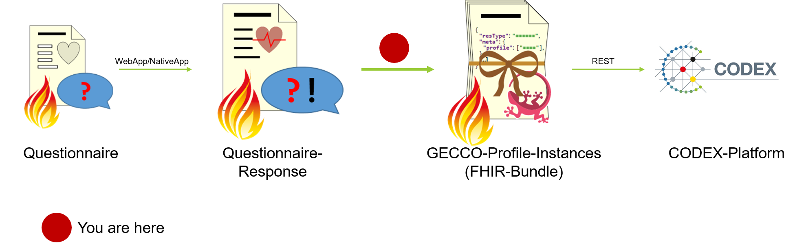
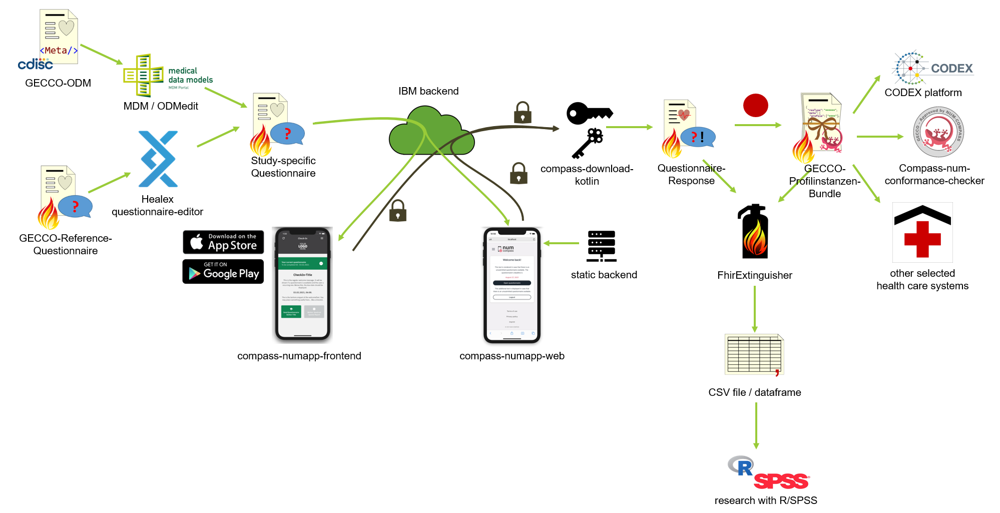

# compass-interface-codex
In short: This is the interface between NUM-Compass (which uses [FHIR Questionnaires](http://hl7.org/fhir/questionnaire.html)) 
and NUM-CODEX RDP platform (which uses the [FHIR GECCO Profiles](https://simplifier.net/guide/germancoronaconsensusdataset-implementationguide/home)).



This project consists of three components, which can also be used on their own:

* **compass-download-kotlin**: A JVM implementation, that basically does the same as the [Python downloader](https://github.com/NUMde/compass-numapp-downloader). It downloads and decrypted the queue items from the backend.
* **gecco-easy**: A set of template functions, that can be used to fill easier the GECCO profiles.
* **gecco-questionnaire**: Defines a logical model for gecco and creates the reference Questionnaire from that, also contains code 
to extract the GECCO Profiles from the logical model.
  
## How dows this work?

The LogicalModel (`gecco-questionnaire/src/main/kotlin/LogicalModel.kt`) is introspected via reflection to generate a reference Questionnaire,
from which the items can be copied into any other Questionnaire. The relation to the LogicalModel is kept in the [`https://num-compass.science/fhir/StructureDefinition/CompassGeccoItem`](https://github.com/NUMde/compass-implementation-guide/blob/master/input/pagecontent/index.md) extension.

This is extension will be also available on the items on the resulting QuestionnaireResponse. This is used to fill the LogicalModel
and then, the LogicalModel can be converted into a Bundle of FHIR resources conforming to the GECCO profiles.

  

## Usage
### IMPORTANT HINT
You need to use **at least Java 8 Update 161, Java 9 or newer**, due to the fact that older versionen cannot use AES with more than
128 Bit due to legal reasons.

## Beginning 
Download .jar file from releases page and execute: 
```
java -jar compass-interface-codex-1.0.1-all.jar 
   --serverUrl "http://127.0.0.1:8080/" 
   --apiId test 
   --apiKey gKdKLYG2g0-Y1EllI0-W 
   --privateKey private_key.pem 
   --publicKey public_key.pem 
   --certificate cacert.pem 
   --targetFhirRepository https://localhost:8082/fhir
   --basicAuth username:password
   --outDir ./out 
   --uploadBundle 
   --uploadBundleEntries 
   --uploadQuestionnaires
   --uploadQuestionnaireResponses
```
The `--targetFhirRepository` is required even if you don't use any of the --upload options, as it is used to generate resource IDs.

This script does the following:
```
foreach queueItem of compassServer.retrieveAllQueueItems():
    questionnaireResponse <- decrypt(queueItem)
    
    if --uploadQuestionnaireResponses is set:
        uploadResourceToFhirRepository(questionnaireResponse)
    
    questionnaire <- retrieveQuestionnaireFromCompassServer(questionnaireResponse.questionnaire)
    copyItemExtension(questionnaireResponse, questionnaire)
    logicalModel <- mapQuestionnaireResponseToLogicalModel(questionnaireResponse)
    bundle <- mapLogicalModelToGeccoProfiles(logicalModel)
    
    if --outDir is set:
        writeToFile(questionnaireResponse)    
        writeToFile(bundle)   
        
    if --uploadBundle is set: 
        uploadResourceToFhirRepository(bundle)
        
    if --uploadBundleEntries is set: 
        foreach entry in bundle:
            uploadResourceToFhirRepository(entry)
        
if --uploadQuestionnaires is set:        
    foreach questionnaire retrieved from server:
        uploadResoureToFhirRepository(questionnaire)         
        
```
`--uploadBundle` and `--uploadBundleEntries` differ in the way the resources are sent to the FHIR server: 
`--uploadBundle` puts the entire Bundle under the `/Bundle` endpoint of the FHIR API, so that you can query one 
QuestionnaireResponse's conversion result using `GET /Bundle/{QueueItemUUID}`, while `--uploadBundleEntries` puts all the
bundle's resources under there corresponding endpoints (like `/Patient`, `/Observation`, ...). `--uploadQuestionnaires` 
also inserts the used Questionnaires into the FHIR repository. This way, you can use the `Import Questionnaire...` function of the 
[FhirExtinguisher](https://github.com/JohannesOehm/FhirExtinguisher) more conveniently.

A direct transfer to the CODEX platform is not yet supported as there are currently no SOPs for that. You can create your 
own component for that (see below). 

## More complex scenarios
To be more flexible, you can easily setup an IDE for Kotlin development (I recommend IntelliJ Community), checkout project 
and edit `src/main/kotlin/custom-main.kt`. If you want to create an executable .jar, run `./gradlew shadowJar` after 
renaming your `custom-main.kt` to `main.kt`.  

# Current limitations
Since the focus of Compass is on PROs (patient reported outcomes), medication and lab module of GECCO are currently not supported. 

# Special cases in the logical model
* `demographics.ageInYears`, `demographics.ageInMonth` and `demographics.birthDate` are interchangeable, just ask for one 
  value in the Questionnaire, the other values will be calculated.
* if `anamnesis.hasChronicLungDiseases`, `anamnesis.hasCardiovascularDiseases`, `anamnesis.hasChronicLiverDiseases`, ..., 
  are set to "NO" or "UNKNOWN", resources will be emitted, which set all corresponding diseases to "NO" or "UNKNOWN".
  
